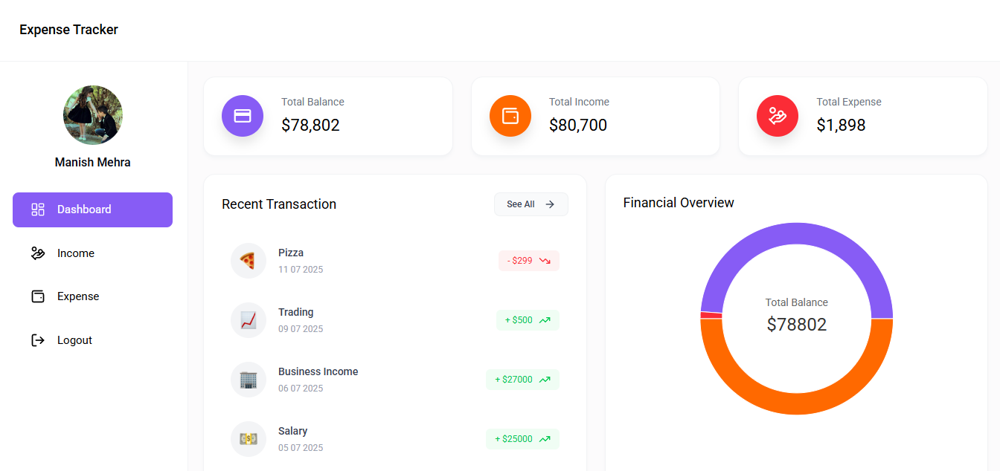
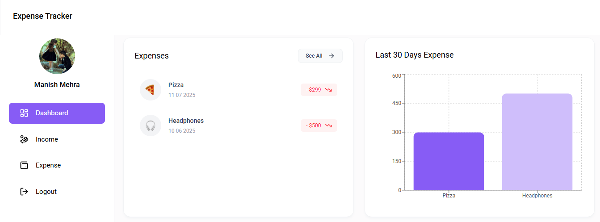
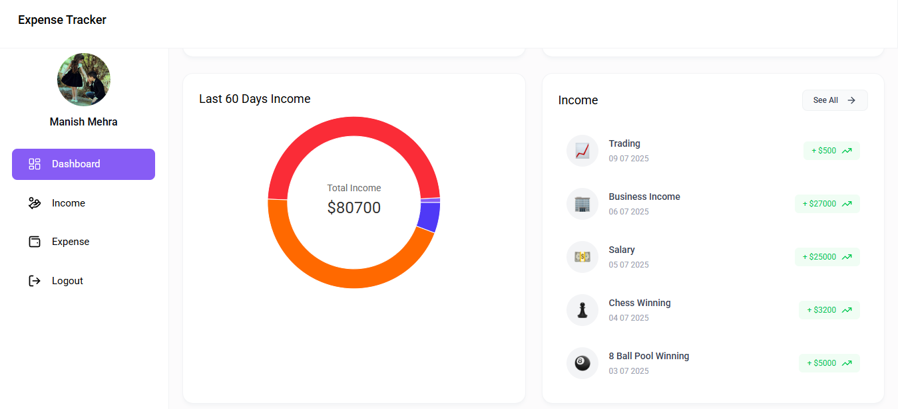
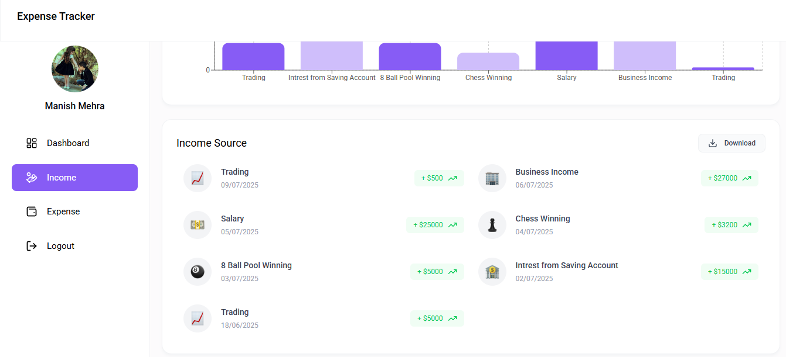
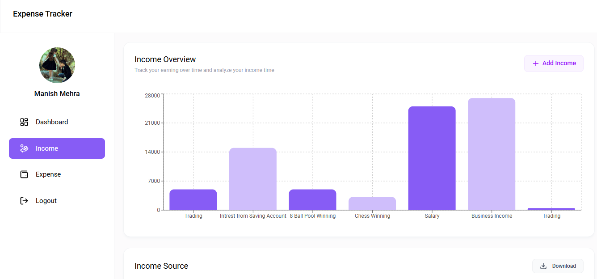
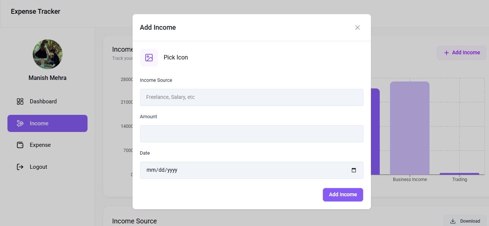
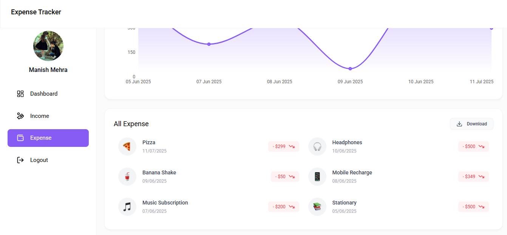
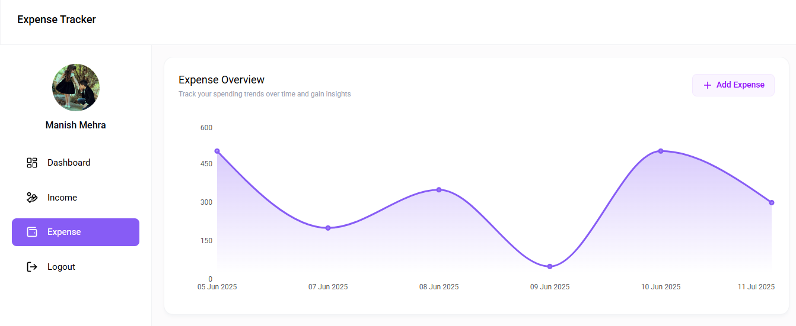
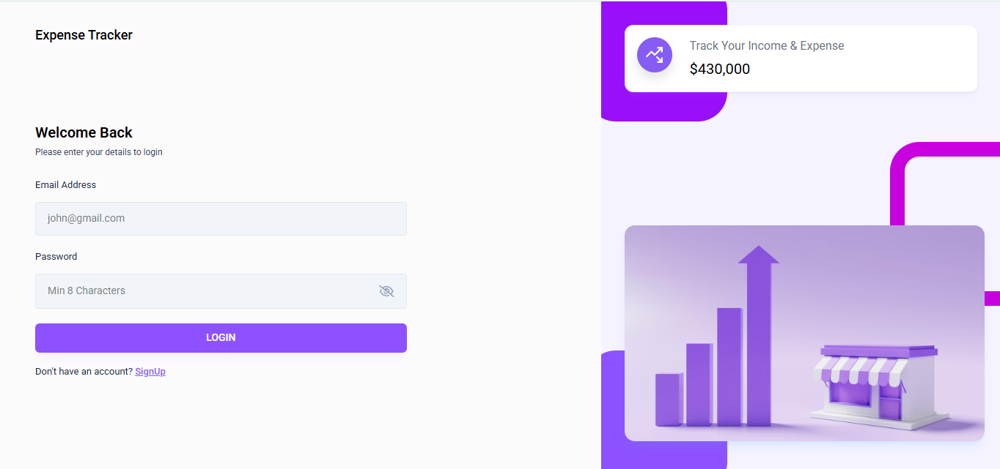

# Expense Tracker

A full-stack Expense Tracker application built with React (Vite) for the frontend and Node.js/Express with MongoDB for the backend. This app allows users to manage their income and expenses, visualize financial data, and securely authenticate.

## Features

- User authentication (sign up, login, JWT-based sessions)
- Add, view, and delete income and expense transactions
- Dashboard with financial overview and charts
- Upload and manage profile photos
- Responsive and modern UI
- RESTful API backend

## Tech Stack

### Frontend
- React (Vite)
- React Router
- Axios
- react-hot-toast
- Custom hooks and context API
- Modern CSS

### Backend
- Node.js
- Express.js
- MongoDB (Mongoose)
- JWT for authentication
- Multer for file uploads
- dotenv for environment variables

## Project Structure

```
backend/
  config/           # Database config
  controllers/      # Route controllers
  middlewares/      # Auth, upload middlewares
  models/           # Mongoose models
  routes/           # API routes
  uploads/          # Uploaded files
  server.js         # Entry point
  .env              # Environment variables
frontend/
  expense-tracker/
    src/
      components/   # Reusable UI components
      context/      # React context (UserProvider)
      hooks/        # Custom hooks
      pages/        # App pages (Login, Dashboard, etc.)
      utils/        # Utility functions
      assets/       # Images and static assets
    public/         # Static files
    App.jsx         # Main app
    ...
```

## Getting Started

### Prerequisites
- Node.js (v16+ recommended)
- npm or yarn
- MongoDB Atlas account (or local MongoDB)

### Backend Setup
1. Go to the `backend` folder:
   ```sh
   cd backend
   ```
2. Install dependencies:
   ```sh
   npm install
   ```
3. Create a `.env` file (see `.env` sample):
   ```env
   MONGO_URI=your_mongodb_connection_string
   JWT_SECRET=your_jwt_secret
   PORT=8000
   ```
4. Start the backend server:
   ```sh
   npm start
   ```
   The server will run on `http://localhost:8000` by default.

### Frontend Setup
1. Go to the frontend folder:
   ```sh
   cd frontend/expense-tracker
   ```
2. Install dependencies:
   ```sh
   npm install
   ```
3. Start the frontend dev server:
   ```sh
   npm run dev
   ```
   The app will run on `http://localhost:5173` by default.

### Environment Variables
- Set `CLIENT_URL` in your backend `.env` to the frontend URL (e.g., `http://localhost:5173`).
- Set `MONGO_URI` and `JWT_SECRET` as needed.

## API Endpoints

- `POST   /api/v1/auth/login`         — User login
- `POST   /api/v1/auth/signup`        — User registration
- `GET    /api/v1/dashboard`          — Dashboard data
- `GET    /api/v1/income`             — List incomes
- `POST   /api/v1/income`             — Add income
- `GET    /api/v1/expense`            — List expenses
- `POST   /api/v1/expense`            — Add expense
- ...and more


## Screenshots

### Dashboard Overview




### All Income


### Income Chart


### Add Income


### All Expenses


### Expenses Chart


### Add Expenses


### Login Page


### Sign Up Page


## License

This project is licensed under the MIT License.

---

**Developed by Manish Kumar and contributors.**
